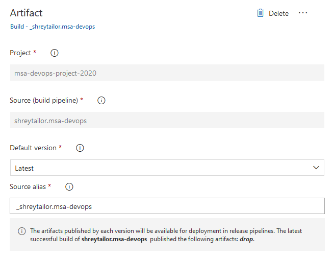
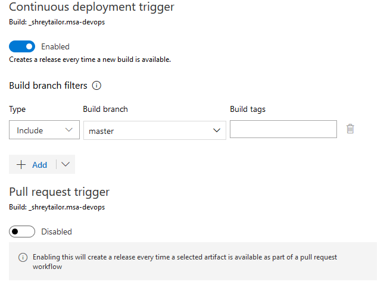

## Table Of Contents <!-- omit in toc -->
- [DevOps](#devops)
  - [Create React Application](#create-react-application)
  - [Initial Deployment](#initial-deployment)
  - [Create A Build Pipeline](#create-a-build-pipeline)
  - [Create A Release Pipeline](#create-a-release-pipeline)
- [Web App (FE)](#web-app-fe)
  - [Basics Of A Component](#basics-of-a-component)
  - [Importing Components](#importing-components)
  - [Protecting Passwords & API Keys](#protecting-passwords--api-keys)
<hr>

# DevOps
> This .README file contains the steps taken to complete the DevOps pathway. The commit history of this repository is a bit different from the steps in the tutorial, because in a discontinuity, I had somehow lost all my progress from the Build Pipeline so had to do it again ):

The prerequisites for this project is to have the latest version of Node installed on your computer. 

## Create React Application
Using `npm`, which is the package manager for Node, we first need to install the boilerplate for react using the following command in our terminal.

```
npm install create-react-app
```

After this, we are ready to create our application so make a new repository on GitHub (with a .README), and then make a copy of it on your computer using the basic git commands. You should now be able to finally create a react application by running the following command in your root directory.

```
npx create-react-app my-app --template typescript
```

## Initial Deployment
From your Azure Portal, we need to click on **Create a resource** and then select "Web App". Fill out the information of your application like shown in the image below.


After doing everything, click on "Review + Create" and then complete the wizard by clicking on "Create".

## Create A Build Pipeline
*A build pipeline is the entity through which you define your automated build steps for your application.* First go to your Azure DevOps portal, and if you haven't already, create a free account using your Microsoft or GitHub account. Create an organization in which you can store many projects, and one or more of your pipelines. In that organization, create a private project with whatever name that suits your project.

Click on "Pipelines" on the left, and then select "Create Pipeline". If you are trying to create a pipeline for your code on GitHub, finish the rest of the process where you must select your repository and also give permissions to edit your code and make commits.

Azure will start us off with a boilerplate (YAML) for our pipeline. For now, we can click on the "Save and Run" button on the top-right corner and make an initial commit on our GitHub project.


Now click on "Pipelines" on the left-side, and go ahead to edit your recently created pipeline. We are now going to edit the default pipeline created for us, in order to suit our application. Remove the starter code under each heading and add the following.

Initially, we are defining the environment variables because we are going to need them often in the configuration process.
```
variables:
    rootDir: 'my-app'
    buildDIr: '$(rootDir)/build'
```

In our pipeline, we are going to be using `npm` so we must install Node.
```
steps:
-   task: NodeTool@0
    inputs:
        versionSpec: '10.x'
    displayName: 'Install Node.js'
```

Before the deployment, we must also build our react application so we use a "script" for that.
```
-   script: |
        cd $(rootDir)
        npm install
        npm run build
        cd ..
    displayName: 'npm install and build'
```

After getting the build, create an archive for it by searching "archive" in the right side-bar. Configure it like below and click "Add".


Thereafter, search for "Publish build artifacts" in the same side-bar, and keep the default setttings. After doing this, you will see more code automatically being added in your YAML file. We have successfully created the Build Pipeline!

## Create A Release Pipeline
*This pipeline is responsible for taking our generated build, and then deploying it.* To create it, click on the "Releases" tab under the "Pipelines" menu on the left-side. Choose "Azure App Service deployment" as the template when prompted. You should now have a default release pipeline. We are now going to add an artifact that this pipeline will deploy so to do that click on "Add an artifact".



Then go to "Tasks" from the top-bar, and configure the settings as shown.


Go back to "Pipeline" from the top-bar, and then click on the lightning symbol which is a continuous deployment trigger - meaning this pipeline will be triggered everytime that a new build is produced by the build pipeline.



Everything is now completed so you can go ahead and save this pipeline, as well as create a new manual release from the top-bar to test if everything is working nicely. To test it from the automation's perspective, if you go back to VS Code, change any code and commit those changes, the pipeline will automatically run and the published application would be a reflection of the updated code.
<hr>

# Web App (FE)
**What is React?** It is a JavaScript front-end framework used to create user interfaces, for websites and mobile devices using React Native. To show any application created from this framework, JavaScript would need to be enabled in your browser. React could be thought of as an Object-Oriented approach to create graphical user interfaces; we can create "components" which could consist of a state, and they are the building blocks for the overall interface.

Here is the code for a simple React component.

## Basics Of A Component
```jsx
// Importing the different packages which are needed.
import React from 'react';

function MyComponent() {
    /*
        Note that the return() function can only contain one parent element,
        but that parent element can contain however many children elements.
    */
    return (
        <div>
            <h1>Hey!</h1>
            <p>I am Shrey Tailor</p>
        </div>
    )
}

/* 
    Process of exporting the component so it can be imported in the main 
    application.
*/
export default App;
```

## Importing Components
After we exported the component from the file above, we can use that compoenent in the main `App.ts` (or any other) file by the process of *importing*. This can be done using the code below.

```jsx
import MyComponent from 'RELATIVE_FILE_PATH';
```

## Protecting Passwords & API Keys
Complex APIs are often paid, charging you depending on your usage. If your API keys are unprotected while deploying on GitHub for example, people would be able to easily steal them. Firstly, add `.env.local` to the git ignore file, in which we will be storing all the secret stuff, and then create the `.env.local` file. You can now add entries in it which look like the following.

```
REACT_APP_API_KEY = 'helloworld'
```

They can now be used within your application by using `process.env.REACT_APP_API_KEY`. You can create multiple enviroment variable files, because you may have different configuration for the local, development and production stage of your application.